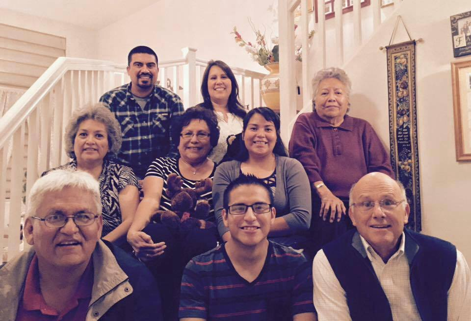

# __Hello Class Introduction__

### My name is **Kevin Hardy** and I am a *Computer Engineer major* :computer: I do have my associates in Liberal 
### arts. I also work at Walmart Distribution Center as fork lift driver. I am from a small town called Navajo, New Mexico

__here is a picture of my family and I__

# What I want to take from this class?
### As a computer engineer I enjoy working with computers rather it is repairing hardware and writing a software. By taking this class I 
### hope to exapnd my computer programming skills in C. In possible, I would like to start a network of computer engineers and computer
### science majors to share and collabrate our ideas together. :smiley:

# List about my favorite foods and hobbies

## Lists of my favorite foods in order
1. Frybread and steam corn stew :stew:
2. pizza :pizza:
  1. supreme
  2. pepporoni
  3. pineapple :pineapple:
3. hot wings :meat_on_bone:
4. burgers :hamburger:
5. spaghetti :spaghetti:

## List of my favorite hobbies
* bowling :bowling:
* workiing out 
  * running
  * hiking trails
  * cycling :bycyclist:
* trying new foods
* video games :video_game:
